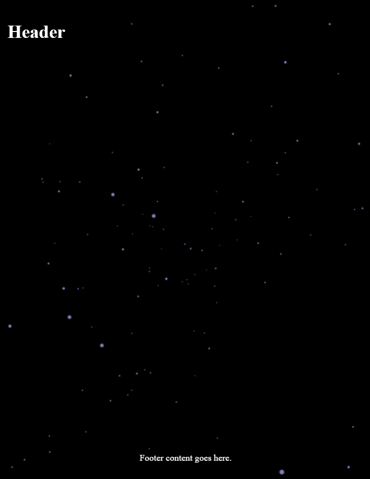

# orbit-space: Beautiful 3D Space Background Component for React

## Features

🪐 Almost realistic 3D Space: It just looks smooth tho.

🛰️ Easy Integration: Just put this component to the App.jsx/App.tsx level. And pass all the application content as children.

🎮 Interactive: Reacts to mouse cursor in a good (not annoying) way.

🌌 Customization Options: Coming soon!

🚀 Lightweight: Built with (some) performance in mind, Orbit-Space maintains a small footprint while delivering stunning visuals.

## Installation
```
npm install orbit-space
```

Then, just use the component like this:

```
import { OrbitSpace } from 'orbit-space'


const App = () => {
  return (
    <>
      <OrbitSpace>
        <div className="app">Your content goes here:</div>
      </OrbitSpace>
    </>
  );
};

export default App;
```

The component is made in a way, so that it 'lays' under your layout:


